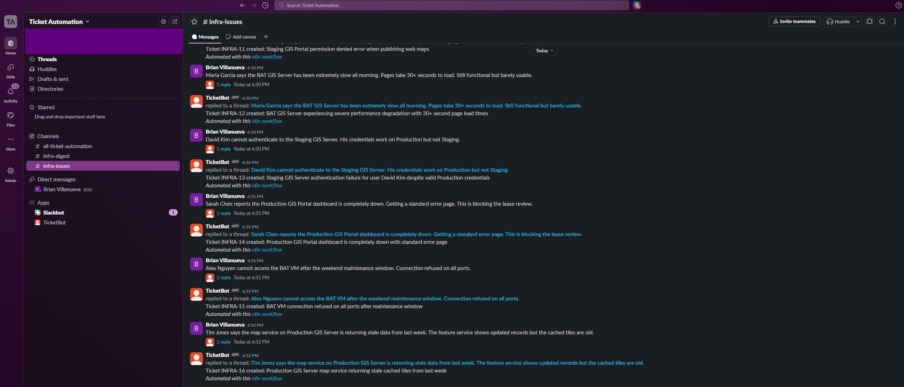
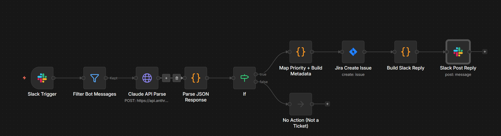
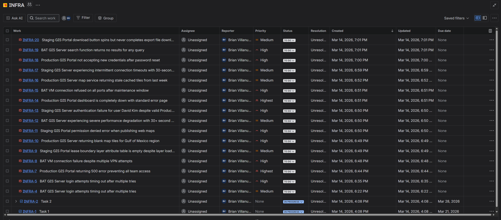
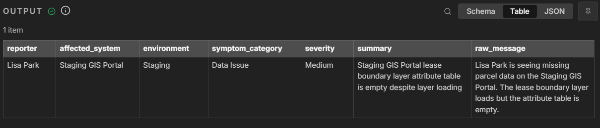

# Slack → AI Ticket Parser → Jira

An AI-powered automation that converts plain-English developer complaints in Slack into fully structured Jira tickets — no forms, no fields, no behavior change required.

**The problem:** Developers don't submit tickets. The ticketing system has too many clicks, too many fields, and too much friction. So issues get reported in Slack, never documented, and when leadership asks why there's no record, the answer is: because the reporting process added more friction than the issue itself.

**The fix:** This system listens to a Slack channel, sends each message to the Claude API for natural language parsing, extracts structured fields (reporter, affected system, environment, symptom category, severity), creates a Jira ticket with all fields populated, and posts a threaded confirmation reply in Slack — all in under 15 seconds.

## Demo

[Loom walkthrough →](#) *(link coming soon)*

## Screenshots

### Slack channel — complaint in, ticket confirmation out


### n8n workflow — 9-node pipeline


### Jira board — auto-generated tickets with priority and labels


### AI parsing output — structured JSON from plain English


## Architecture

```
Slack #infra-issues channel
        │
        ▼
   n8n Workflow
        │
        ├─→ Filter (bot messages, edits, joins)
        │
        ├─→ Claude API (NLP parse → structured JSON)
        │       │
        │       ├── reporter
        │       ├── affected_system
        │       ├── environment (BAT / Staging / Production)
        │       ├── symptom_category (Auth Failure, Connectivity, Outage, etc.)
        │       ├── severity (Critical / High / Medium / Low)
        │       └── summary (ticket title)
        │
        ├─→ Jira Cloud (create Bug with all fields)
        │
        └─→ Slack (threaded reply with ticket link)
```

## What the AI does

The Claude API receives a plain-English message like:

> "Tim Jones cannot log into the BAT GIS Server. Tried 3 times, keeps timing out."

And returns structured JSON:

```json
{
  "reporter": "Tim Jones",
  "affected_system": "BAT GIS Server",
  "environment": "BAT",
  "symptom_category": "Authentication Failure",
  "severity": "High",
  "summary": "BAT GIS Server login attempts timing out after multiple retries",
  "raw_message": "Tim Jones cannot log into the BAT GIS Server. Tried 3 times, keeps timing out."
}
```

The prompt includes severity rules mapped to operational context (Production down = Critical, BAT/Staging blocking development = High), symptom taxonomy built around real infrastructure failure modes, and a non-ticket filter that ignores casual conversation.

## Stack

| Component | Tool | Cost |
|-----------|------|------|
| Input | Slack (free tier) | $0 |
| Orchestration | n8n (open source or cloud) | $0 |
| AI parsing | Claude API (Sonnet) | ~$0.002/ticket |
| Ticketing | Jira Cloud (free tier, 10 users) | $0 |

Total cost at 50 tickets/day: under $3/month.

## Repo contents

```
├── n8n_ticket_automation_workflow.json   # Importable n8n workflow (scrubbed)
├── ticket_parser_prompt.md              # Claude API system prompt + test cases
├── slack_reply_template.md              # Slack Block Kit payload for confirmations
├── setup_checklist.md                   # Full setup guide with prerequisites
├── screenshots/                         # Demo screenshots
└── README.md
```

## Setup

See [setup_checklist.md](setup_checklist.md) for the full guide. Summary:

1. Create a Slack workspace + app with bot scopes (`channels:history`, `chat:write`, `reactions:read`)
2. Create a Jira Cloud project with Bug issue type
3. Get a Claude API key ($5 in credits lasts months)
4. Import `n8n_ticket_automation_workflow.json` into n8n
5. Replace three placeholders: `YOUR_CHANNEL_ID`, project ID, Jira domain
6. Enable Slack Event Subscriptions pointing to your n8n webhook URL
7. Post a test message and watch the ticket appear

## Design decisions

**Why Slack as the input:** Developers already complain in chat. Zero behavior change required. The lowest-friction input is the one they're already using.

**Why Claude for parsing:** The NLP layer does real structural work — extracting named entities, classifying symptoms into a taxonomy, and inferring severity from context. Rule-based parsing would break on the natural language variation in real developer complaints.

**Why threaded replies:** Channel-level replies create noise. Threading keeps confirmations attached to the original complaint. Developers verify in 3 seconds; everyone else sees a clean channel.

**Why the non-ticket filter:** Without it, casual conversation generates garbage tickets. The prompt instructs the LLM to return `is_ticket: false` for non-issues, and the workflow stops before hitting Jira.

**Why the human-in-the-loop:** The "react with X to flag for review" pattern gives developers a one-click way to say "the bot got this wrong" without leaving Slack. No form. No second message. The system self-corrects.

## Built by

**Brian Villanueva** — Business Systems Architect | Workflow Automation | AI-Enabled Process Design

[LinkedIn](https://linkedin.com/in/brianvillanueva) · bav401@gmail.com
